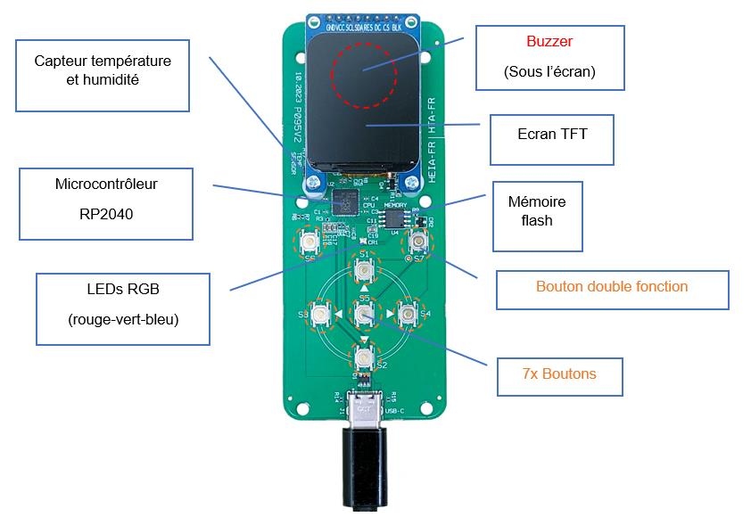

# PICOMO Hardware

## Pin assignment

| Function                 | Pin (V1) | Pin (V2) |
|--------------------------|----------|----------|
| Button Up (S1)           | -        | GPIO3    |
| Button Down (S2)         | -        | GPIO5    |
| Button Left (S3)         | -        | GPIO22   |
| Button Right (S4)        | -        | GPIO7    |
| Button Middle (S5)       | -        | GPIO4    |
| Button Top-Left (S6)     | -        | GPIO23   |
| Button Top Right (S7)    | -        | GPIO6    |
| Button Top Left  (S1)    | GPIO22   | -        |
| Button Middle Left (S2)  | GPIO23   | -        |
| Button Bottom Left (S3)  | GPIO25   | -        |
| Button Top Right (S4)    | GPIO8    | -        |
| Button Middle Right (S5) | GPIO2    | -        |
| Button Bottom Right (S6) | GPIO1    | -        |
| Button BOOTSEL (S7)      | -        | -        |
| LED Red (PWM)            | GPIO10   | GPIO10   |
| LED Green (PWM)          | GPIO11   | GPIO9    |
| LED Blue (PWM)           | GPIO9    | GPIO8    |
| Buzzer                   | GPIO0    | GPIO11   |
| Temperature SDA (I2C)    | GPIO6    | GPIO20   |
| Temperature SCL (I2C)    | GPIO7    | GPIO21   |
| Display SCL (I2C)        | GPIO14   | GPIO18   |
| Display SDA (I2C)        | GPIO15   | GPIO19   |
| Display DC               | GPIO12   | GPIO16   |
| Display CS               | GPIO13   | GPIO17   |
| USB Over Current         | GPIO24   | GPIO24   |
| ADC                      | GPIO29   | GPIO29   |

## Notes

Buttons, LEDs, Buzzer are _active low_. This means that
you need to set the GPIO to 0 to activate the component.

The buttons do not have external pull-ups, so
you need to active it at the GPIO internal level.

The resonance frequency of the [buzzer](https://product.tdk.com/en/search/sw_piezo/sw_piezo/piezo-buzzer/info?part_no=PS1240P02BT) is 4 kHz

The flash memory chip is the [W25Q16JVSSIQ](https://www.winbond.com/hq/product/code-storage-flash-memory/serial-nor-flash/?__locale=en&partNo=W25Q16JV) (2 MB)
